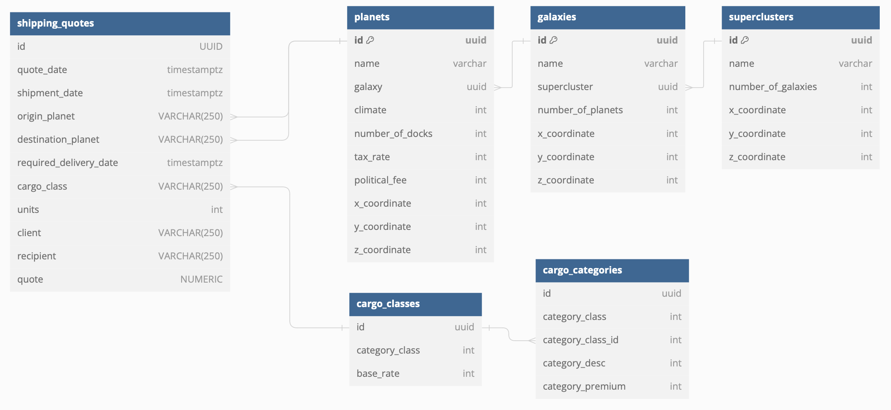

# 

## Cosmic Cargo Network

##### Cosmic Cargo Network is a mock company I am building to practice Go and other backend concepts. Cosmic Cargo Network is a galactic shipping organization that services 3 superclusters, 6 galaxies, and 50 planets. We provide various APIs from distance calculators to pricing quotes to availability statuses.

#### Work in progress....

### Table of Contents

1. [Introduction](#introduction)
2. [Features](#features)
3. [Installation](#installation)
4. [Usage](#usage)
5. [Examples](#examples)
6. [Roadmap](#roadmap)
7. [Contributing](#contributing)
8. [License](#license)
9. [Acknowledgements](#acknowledgements)

## Introduction

Welcome to **Cosmic Cargo Network**! This project aims to create an efficient and scalable network for interstellar cargo transport.

Database Layout


## Features

- APIs to print all planets, galaxies, superclusters, cargo categories, and cargo classes.
- Distance calculator
- Shipping quote (v2 coming soon....)
- Cargo Endpoints (coming soon...)

## Installation

Coming Soon

### Prerequisites

- Go
- PostgreSQL

### Installation Steps

1. Clone the repository:
   ```sh
   git clone https://github.com/aleciberg/cosmiccargonetwork.git
   ```

## Usage

To start the project, run:

```sh
go run server.go
```

The server is now running at http://localhost:1323

## API Documentation

### Overview

This API provides endpoints for interacting with the XYZ service. Below, you will find the available routes, their descriptions, request formats, and sample responses.

### API Endpoints

---

#### POST /shipping

Receive a shipping quote.

- **URL**: `/shipping`
- **Method**: `POST`
- **Request**:

  #### originPlanet and destinationPlanet are the id's, can be retrieved with below endpoints.

  #### cargoCategoryId can be obtained from the database after running migrations. Endpoint to come.

  <details>
      <summary>View Sample Request</summary>

  ```json
  {
    "shipmentDate": "2024-08-22T14:35:00Z",
    "originPlanet": "00000000-0000-0000-0000-000000000010",
    "destinationPlanet": "00000000-0000-0000-0000-000000000027",
    "requiredDeliveryDate": "2024-08-22T14:35:00Z",
    "cargoCategoryId": "0a7dd350-2caf-4693-b8b9-0f290e446ff5",
    "units": 2,
    "client": "Disney",
    "recipient": "Satan"
  }
  ```

     </details>

- **Response**:

  - **Status**: `200 OK`
   <details>
  <summary>View Sample Response</summary>

  ```json
  {
    "originPlanet": "Hoth",
    "destinationPlanet": "Arrakis",
    "distance": 1825
  }
  ```

    </details>

#### GET /distance

Retrieve the distance between 2 planets.

- **URL**: `/planets`
- **Method**: `GET`
- **Request**:
  Sample Url: http://localhost:1323/distance?originPlanet=Hoth&destinationPlanet=Arrakis

- **Response**:

  - **Status**: `200 OK`
   <details>
  <summary>View Sample Response</summary>

  ```json
  {
    "originPlanet": "Hoth",
    "destinationPlanet": "Arrakis",
    "distance": 1825
  }
  ```

    </details>

#### GET /planets

Retrieve a list of all planets.

- **URL**: `/planets`
- **Method**: `GET`
- **Response**:

  - **Status**: `200 OK`
   <details>
  <summary>View Sample Response</summary>

  ```json
  [
    {
      "ID": "00000000-0000-0000-0000-000000000001",
      "Name": "Alderaan",
      "Galaxy": "c671a14f-9552-4707-bc8d-a065597c351a",
      "Climate": 0,
      "NumberOfDocks": 2,
      "TaxRate": 15,
      "PoliticalFee": 100,
      "XCoordinate": 145.57,
      "YCoordinate": -340.59,
      "ZCoordinate": 6589.16
    },
    {
      "ID": "00000000-0000-0000-0000-000000000002",
      "Name": "Arrakis",
      "Galaxy": "c671a14f-9552-4707-bc8d-a065597c351a",
      "Climate": 1,
      "NumberOfDocks": 3,
      "TaxRate": 10,
      "PoliticalFee": 200,
      "XCoordinate": 132.88,
      "YCoordinate": -127.85,
      "ZCoordinate": 7249.32
    }
  ]
  ```

  </details>

#### GET /planets:name

Retrieve information about a specific planet.

- **URL**: `/planets`
- **Method**: `GET`
- **Response**:

  - **Status**: `200 OK`
   <details>
  <summary>View Sample Response</summary>

  ```json
  [
    {
      "ID": "00000000-0000-0000-0000-000000000005",
      "Name": "Hoth",
      "Galaxy": "c671a14f-9552-4707-bc8d-a065597c351a",
      "Climate": 4,
      "NumberOfDocks": 2,
      "TaxRate": 5,
      "PoliticalFee": 250,
      "XCoordinate": 199.67,
      "YCoordinate": -671.5,
      "ZCoordinate": 5508.45
    }
  ]
  ```

    </details>

  #### GET /galaxies

Retrieve a list of all galaxies.

- **URL**: `/galaxies`
- **Method**: `GET`
- **Response**:

  - **Status**: `200 OK`
   <details>
  <summary>View Sample Response</summary>

  ```json
  [
    {
      "ID": "c671a14f-9552-4707-bc8d-a065597c351a",
      "Name": "Acostas",
      "Supercluser": "",
      "NumberOfPlanets": 6,
      "XCoordinate": 167.23,
      "YCoordinate": -459.56,
      "ZCoordinate": 7001.89
    },
    {
      "ID": "0f023e67-0156-441f-bcf5-d03ff20f60ef",
      "Name": "Fright",
      "Supercluser": "",
      "NumberOfPlanets": 5,
      "XCoordinate": 12.45,
      "YCoordinate": -666.89,
      "ZCoordinate": 8413.34
    }
  ]
  ```

  </details>

#### GET /galaxies:name

Retrieve information about a specific galaxy.

- **URL**: `/galaxies:name`
- **Method**: `GET`
- **Response**:

  - **Status**: `200 OK`
   <details>
  <summary>View Sample Response</summary>

  ```json
  [
    {
      "ID": "0f023e67-0156-441f-bcf5-d03ff20f60ef",
      "Name": "Fright",
      "Supercluser": "",
      "NumberOfPlanets": 5,
      "XCoordinate": 12.45,
      "YCoordinate": -666.89,
      "ZCoordinate": 8413.34
    }
  ]
  ```

      </details>

#### GET /superclusters

Retrieve a list of all superclusters.

- **URL**: `/superclusters`
- **Method**: `GET`
- **Response**:

  - **Status**: `200 OK`
   <details>
  <summary>View Sample Response</summary>

  ```json
  [
    {
      "ID": "182b1bd8-5fb2-4b67-8981-ac798d0ac3dc",
      "Name": "Supercluster Alpha",
      "NumberOfGalaxies": "3",
      "XCoordinate": 132.34,
      "YCoordinate": -569.78,
      "ZCoordinate": 9100.01
    },
    {
      "ID": "e1d6588f-e07b-48c1-b151-28c03fc553a4",
      "Name": "Supercluster Beta",
      "NumberOfGalaxies": "3",
      "XCoordinate": -354.56,
      "YCoordinate": 780.9,
      "ZCoordinate": -1221.34
    },
    {
      "ID": "38e209a4-e821-4b0a-8974-f46f00f36599",
      "Name": "Supercluster Gamma",
      "NumberOfGalaxies": "3",
      "XCoordinate": 4578.67,
      "YCoordinate": -23.45,
      "ZCoordinate": 670.89
    }
  ]
  ```

  </details>

#### GET /superclusters:name

Retrieve information about a specific supercluster.

- **URL**: `/superclusters:name`
- **Method**: `GET`
- **Response**:

  - **Status**: `200 OK`
   <details>
  <summary>View Sample Response</summary>

  ```json
  [
    {
      "ID": "38e209a4-e821-4b0a-8974-f46f00f36599",
      "Name": "Supercluster Gamma",
      "NumberOfGalaxies": "3",
      "XCoordinate": 4578.67,
      "YCoordinate": -23.45,
      "ZCoordinate": 670.89
    }
  ]
  ```

        </details>
